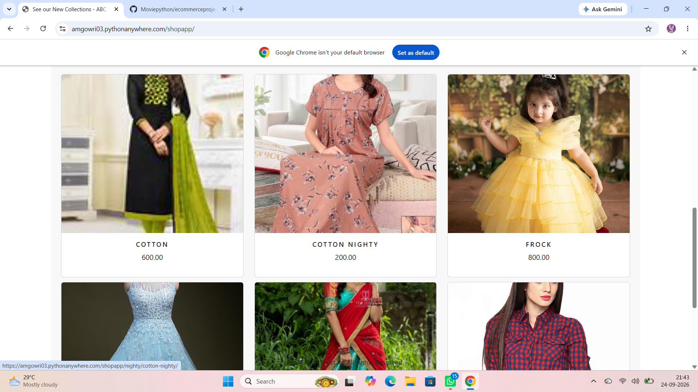
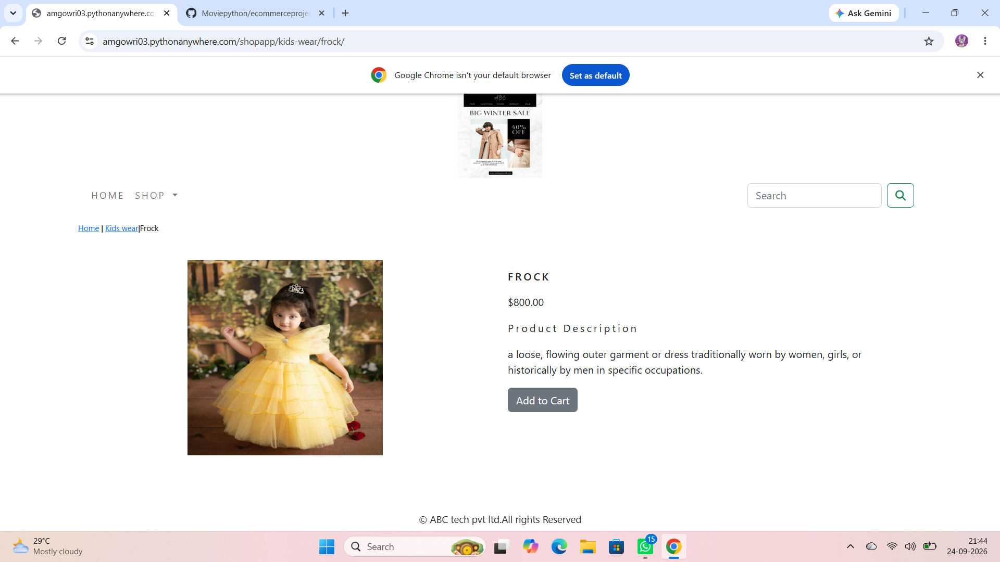
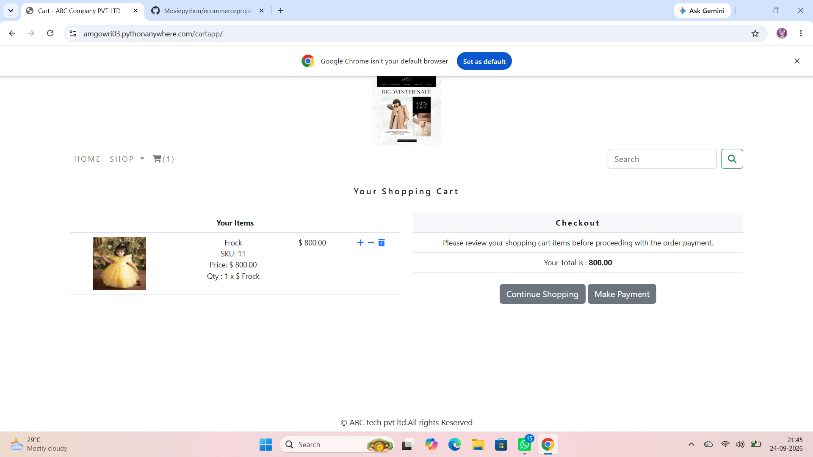

# 🛒 E-commerce Project - Django

My E-commerce website built with Python Django.

## 📸 Screenshots

### 1. Home Page

### 2. Home - Products

### 3. Product Page

### 4. Cart Page

## Tech Stack
- Python, Django
- HTML, CSS, Bootstrap
- SQLite
