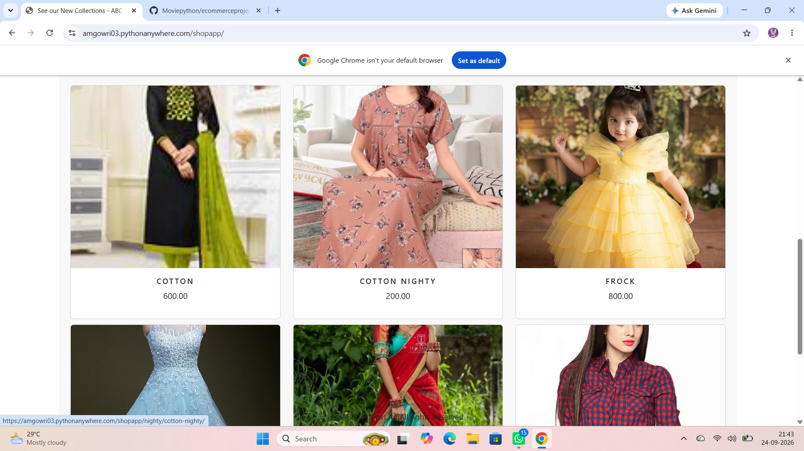
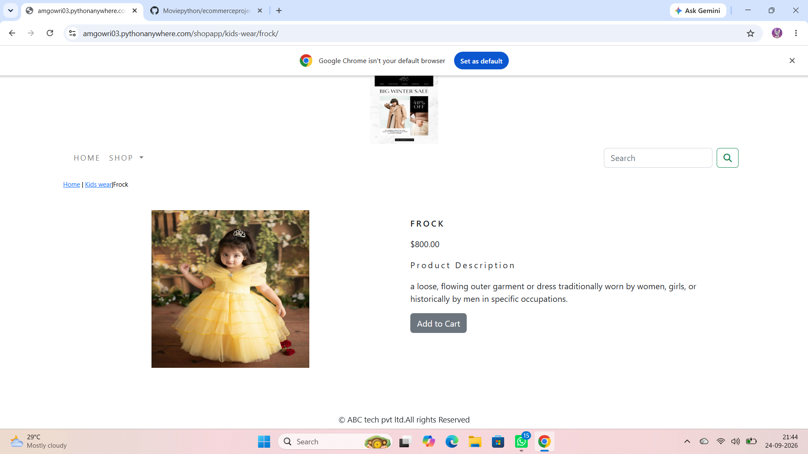
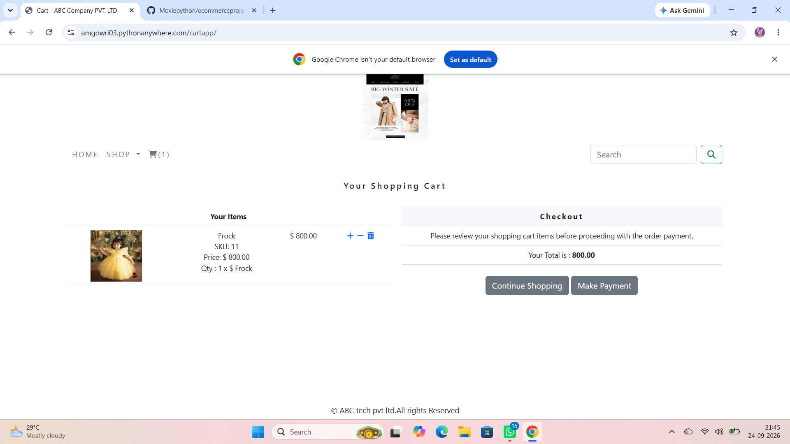

# 🛍️ StyleHub - Fashion Store | Django E-Commerce

🔴 **Live Demo:** https://amgowri03.pythonanywhere.com/shopapp/
💻 **GitHub:** https://github.com/GowriAM/e-commerce-website-django

A complete Fashion E-Commerce platform built with Django - Browse, Search, Add to Cart!

> Built by Gowri AM | BTech CSE 2025 | Python Developer

### 🚀 Key Features
- User Authentication (Register, Login, Logout)
- Product Listing with Category Filter
- Product Details with Image
- Shopping Cart - Add / Remove / Quantity Update
- Product Search Functionality
- Admin Panel to Manage Products

### 🛠️ Tech Stack
**Backend:** Python, Django
**Frontend:** HTML5, CSS3, Bootstrap, JavaScript
**Database:** SQLite -> MySQL
**Deployment:** PythonAnywhere

### 📸 Screenshots

**Home - Collections**

**Home - All Products**

**Product Page**

**My Cart**

### 🔗 Links
- Live: https://amgowri03.pythonanywhere.com/shopapp/
- Movie World Live: https://gowriam2.pythonanywhere.com

### ⚙️ Run Locally
